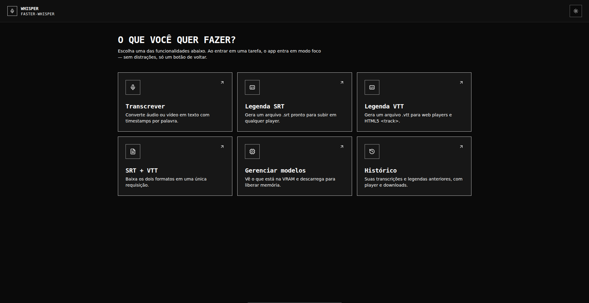

# Faster-Whisper API

Aplicação full-stack para transcrição de áudio/vídeo e geração de legendas SRT/VTT usando Faster-Whisper, FastAPI e uma interface web em React/Vite.

<p align="center">
  
</p>

## Recursos

- Transcrição com timestamps por segmento e por palavra.
- Geração de legendas nos formatos SRT, VTT ou ambos.
- Interface web para transcrever, gerar legendas, consultar histórico e gerenciar modelos.
- Histórico persistido em `outputs/history.json`, com acesso ao áudio/vídeo original.
- Seleção de modelo por requisição: `tiny`, `small`, `medium`, `large-v2`, `large-v3`.
- Conversão opcional via FFmpeg para WAV mono 16 kHz antes da transcrição.
- Cache de modelos em memória/VRAM com descarregamento automático por inatividade.

## Requisitos

- Python 3.10+
- Node.js 20+
- ffmpeg instalado no sistema
- CUDA 11.x ou 12.x para uso com GPU

```bash
sudo apt install ffmpeg
```

## Instalação

```bash
# 1. Entrar na pasta do projeto
cd whisper-api

# 2. Criar ambiente virtual
python -m venv venv
source venv/bin/activate

# 3. Instalar dependências da API
pip install -r requirements.txt

# 4. Configurar variáveis de ambiente da API
cp .env.example .env

# 5. Instalar dependências do frontend
cd web
npm install
cp .env.example .env
```

## Configuração

Principais variáveis da API em `.env`:

```env
WHISPER_MODEL=small
WHISPER_DEVICE=cuda
WHISPER_COMPUTE_TYPE=float16
WHISPER_CPU_THREADS=4
MAX_UPLOAD_SIZE_MB=500
UPLOAD_DIR=uploads
OUTPUT_DIR=outputs
DEFAULT_LANGUAGE=pt
VAD_FILTER=true
WORD_TIMESTAMPS=true
MODEL_UNLOAD_TIMEOUT=300
```

O código usa `large-v3` como padrão interno, mas o `.env.example` começa com `small` para facilitar o primeiro teste em máquinas com menos VRAM.

Para rodar sem GPU, use por exemplo:

```env
WHISPER_DEVICE=cpu
WHISPER_COMPUTE_TYPE=int8
```

Principais variáveis do frontend em `web/.env`:

```env
VITE_API_URL=http://localhost:8000
```

## Rodar

API:

```bash
uvicorn app.main:app --host 0.0.0.0 --port 8000 --reload
```

Frontend:

```bash
cd web
npm run dev
```

Acesse:

- API: http://localhost:8000
- Documentação interativa: http://localhost:8000/docs
- Frontend: http://localhost:5173

## Arquivos suportados

Extensões aceitas para upload:

```text
.mp3, .mp4, .wav, .m4a, .ogg, .flac, .mkv, .webm, .mov
```

## Endpoints

### `GET /health`

Healthcheck simples da API.

```bash
curl http://localhost:8000/health
```

### `GET /api/v1/models`

Lista modelos disponíveis, modelo padrão e limite de upload configurado.

```bash
curl http://localhost:8000/api/v1/models
```

### `GET /api/v1/models/status`

Mostra quais modelos estão carregados e em quanto tempo serão descarregados por inatividade.

```bash
curl http://localhost:8000/api/v1/models/status
```

### `POST /api/v1/models/{model_name}/unload`

Descarrega manualmente um modelo da VRAM/memória.

```bash
curl -X POST http://localhost:8000/api/v1/models/large-v3/unload
```

### `POST /api/v1/transcribe`

Transcrição completa em JSON com timestamps por segmento e, se habilitado, por palavra.

```bash
curl -X POST "http://localhost:8000/api/v1/transcribe?language=pt&model=large-v3&word_timestamps=true&vad_filter=true&ffmpeg_convert=false" \
  -F "file=@audio.mp3"
```

Resposta resumida:

```json
{
  "id": "a1b2c3d4e5f6",
  "audio_url": "/api/v1/history/a1b2c3d4e5f6/audio",
  "model": "large-v3",
  "language": "pt",
  "language_probability": 0.99,
  "duration": 120.5,
  "word_timestamps": true,
  "vad_filter": true,
  "segments": [
    {
      "start": 0.0,
      "end": 3.2,
      "text": "Olá, tudo bem?",
      "words": [
        { "word": "Olá,", "start": 0.0, "end": 0.4, "probability": 0.99 }
      ]
    }
  ]
}
```

### `POST /api/v1/subtitle/srt`

Retorna arquivo `.srt` como texto para download.

```bash
curl -X POST "http://localhost:8000/api/v1/subtitle/srt?language=pt&ffmpeg_convert=true" \
  -F "file=@video.mp4" \
  -o legenda.srt
```

### `POST /api/v1/subtitle/vtt`

Retorna arquivo `.vtt` como texto para download.

```bash
curl -X POST "http://localhost:8000/api/v1/subtitle/vtt?language=pt&ffmpeg_convert=true" \
  -F "file=@video.mp4" \
  -o legenda.vtt
```

### `POST /api/v1/subtitle/both`

Retorna SRT e VTT juntos em um único JSON.

```bash
curl -X POST "http://localhost:8000/api/v1/subtitle/both?language=pt" \
  -F "file=@video.mp4"
```

Resposta resumida:

```json
{
  "id": "a1b2c3d4e5f6",
  "audio_url": "/api/v1/history/a1b2c3d4e5f6/audio",
  "model": "large-v3",
  "language": "pt",
  "language_probability": 0.99,
  "duration": 120.5,
  "srt": "1\n00:00:00,000 --> 00:00:03,200\nOlá, tudo bem?\n",
  "vtt": "WEBVTT\n\n00:00:00.000 --> 00:00:03.200\nOlá, tudo bem?\n"
}
```

### `GET /api/v1/history`

Lista o histórico de transcrições e legendas, sem o payload completo.

```bash
curl http://localhost:8000/api/v1/history
```

### `GET /api/v1/history/{entry_id}`

Retorna os detalhes de uma entrada do histórico, incluindo o payload completo.

```bash
curl http://localhost:8000/api/v1/history/a1b2c3d4e5f6
```

### `GET /api/v1/history/{entry_id}/audio`

Faz stream do áudio/vídeo original salvo no histórico.

```bash
curl http://localhost:8000/api/v1/history/a1b2c3d4e5f6/audio -o audio-original.mp3
```

### `DELETE /api/v1/history/{entry_id}`

Remove uma entrada do histórico e o arquivo original associado.

```bash
curl -X DELETE http://localhost:8000/api/v1/history/a1b2c3d4e5f6
```

### `DELETE /api/v1/history`

Remove todo o histórico e os arquivos originais associados.

```bash
curl -X DELETE http://localhost:8000/api/v1/history
```

## Parâmetros de transcrição

Os endpoints `/transcribe`, `/subtitle/srt`, `/subtitle/vtt` e `/subtitle/both` aceitam os mesmos parâmetros de query:

| Parâmetro | Padrão | Descrição |
| --- | --- | --- |
| `language` | `pt` | Código do idioma, como `pt`, `en`, `es`, `fr`, `de`, `ja`. |
| `model` | `.env` | Modelo Faster-Whisper a usar na requisição. |
| `word_timestamps` | `.env` | Habilita timestamps por palavra. |
| `vad_filter` | `.env` | Remove silêncios usando VAD. |
| `ffmpeg_convert` | `false` | Converte o arquivo para WAV mono 16 kHz antes da transcrição. |

## Frontend

A interface web inclui rotas para:

- `/transcribe`: transcrição completa com prévia do arquivo e resultado segmentado.
- `/subtitle/srt`: geração de SRT.
- `/subtitle/vtt`: geração de VTT.
- `/subtitle/both`: geração de SRT e VTT juntos.
- `/history`: listagem, detalhes e exclusão do histórico.
- `/models`: status dos modelos carregados e descarregamento manual.

Scripts disponíveis em `web/package.json`:

```bash
npm run dev      # servidor local Vite
npm run build    # build de produção
npm run preview  # preview do build
npm run lint     # checagem TypeScript
```

## Estrutura do projeto

```text
whisper-api/
├── app/
│   ├── main.py                 # Entry point FastAPI
│   ├── config.py               # Configurações via .env
│   ├── routers/
│   │   ├── transcription.py    # Endpoints de transcrição, legendas e modelos
│   │   └── history.py          # Endpoints de histórico
│   └── services/
│       ├── whisper_service.py  # Cache/carregamento de modelos e transcrição
│       ├── subtitle_service.py # Geração de SRT e VTT
│       ├── ffmpeg_service.py   # Conversão opcional via FFmpeg
│       └── history_service.py  # Persistência do histórico
├── assets/
│   └── screenshot.png
├── uploads/                    # Arquivos originais salvos para histórico
├── outputs/                    # Histórico persistido em history.json
├── web/                        # Frontend React/Vite
├── .env.example
├── requirements.txt
└── README.md
```

## Observações

- `uploads/`, `outputs/`, `venv/`, `.env`, `node_modules/` e builds do frontend são ignorados pelo Git.
- O primeiro uso de um modelo pode demorar porque o Faster-Whisper precisa carregar o modelo em memória/VRAM.
- `MODEL_UNLOAD_TIMEOUT=0` desativa o descarregamento automático por inatividade.
