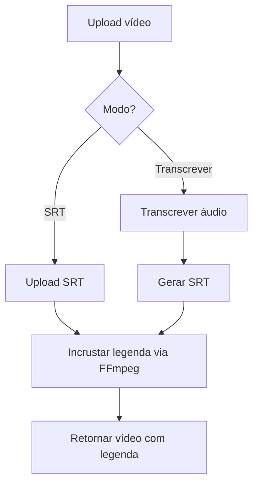

# Burn Subtitle — Design

## Decisões de Arquitetura

### Abordagem para incorporação de legenda

**Opção A: Legenda hardcoded (burn-in)**
- Usar filtro FFmpeg `subtitles` para renderizar a legenda diretamente no vídeo
- Vantagem: legenda visível em qualquer player, sem suporte a tracks
- Desvantagem: recodifica o vídeo (lento para arquivos grandes)

**Opção B: Legenda como stream separada**
- Usar FFmpeg para adicionar track de legenda ao container
- Vantagem: rápido, sem recodificação
- Desvantagem: nem todos os players suportam

**Decisão: Opção A (hardcoded)** — mais compatível com o objetivo do usuário de "adicionar legenda ao vídeo".

### Endpoint único com modos

O endpoint `POST /api/v1/subtitle/burn` aceita:
- `file`: arquivo de vídeo (obrigatório)
- `subtitle_file`: arquivo SRT (modo SRT)
- Parâmetros de transcrição: `language`, `model`, `word_timestamps`, `vad_filter` (modo transcrição)

Lógica:
- Se `subtitle_file` fornecido → usa SRT direto
- Se parâmetros de transcrição → transcreve primeiro, gera SRT, depois incrusta

### Fluxo principal



### FFmpeg command para hardcode

```bash
ffmpeg -i video.mp4 -vf "subtitles=legenda.srt" -c:a copy output.mp4
```

- `-vf "subtitles=legenda.srt"`: filtro de legenda hardcoded
- `-c:a copy`: mantém áudio sem recodificação
- Vídeo é recodificado (necessário para burned-in subtitles)

### Interfaces principais

```python
# Router
POST /api/v1/subtitle/burn
  Form params:
    - file: UploadFile (vídeo)
    - subtitle_file: UploadFile | None (SRT)
    - language: str = "pt"
    - model: str | None
    - word_timestamps: bool = True
    - vad_filter: bool = True
    - ffmpeg_convert: bool = False

  Response: StreamingResponse (vídeo MP4)

# Service
def burn_subtitle(
    video_path: str,
    srt_path: str,
) -> str:
    """Incorpora SRT no vídeo via FFmpeg. Retorna caminho do output."""
```

### Estrutura de arquivos

```
app/
  routers/
    transcription.py  → adicionar endpoint POST /subtitle/burn
  services/
    ffmpeg_service.py → adicionar burn_subtitle()
```

### Trade-offs

| Aspecto | Decisão |
|---------|---------|
| Velocidade | Lenta (recodifica vídeo) — aceitável para use case de produção |
| Compatibilidade | Alta — legenda visível em qualquer player |
| Complexidade | Baixa — um endpoint, uma função de service |
| Temporários | Arquivo SRT temporário e output temporário são limpos após envio |
